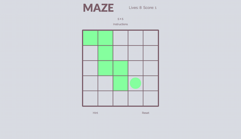

# Maze
*******************************************************************************

### GA WDI London - Project 1

#### A path finding game

This game involves a user travelling across a grid from the north-western most corner to the south-eastern most corner. There is only one correct way across the grid, as defined by a random path generated by the computer.

[Play Maze here.](https://freemaze.herokuapp.com/)

 

##### Rules

- User begins with 10 lives and must find the way to the south-eastern most corner of the grid.
- The user can only move down (south) or across (east), using either the keys or clicks.
- If the square moved to is correct, the user can continue.
- If the square moved to is incorrect, the user loses a life and is returned to the start.
- If the end is reached, the user scores a point.
- If a score of three is reached, the user gains a life.
- If the user loses all their lives, the game is over. 
- A hint, that reveals the correct path for a fractionof a second, is available to the user at the cost of a life. 
- If the user only has one life remaining, the hint option is disabled.

##### How it works

The page loads with a 3x3 grid loaded as standard. Selection of a different level causes a new grid to be created dynamically.
A random path across the grid, from the north-western most corner to the south-eastern most corner, is generated by the computer. This works by modelling the grid on the screen as an array of nested arrays. The computer randomly decides to move across the grid (to the next element in the next nested array) or down the grid (to the equivalent element in the next nested array). This move is stored in a variable and executed unless a boundary condition isn't satisfied, for example the edge of the grid has been reached.
A new path is generated every time a grid is created. The squares used in the random path are pushed to an array.
The user inputs a move by either using the arrow keys or mouse clicks. This is stored in a variable and then pushed to an array. Its value triggers the movement of the cursor inside the grid.
After each move, the user move array is compared to the random path array. If the elements agree the move is correct and the user can continue. If the elements disagree, the move is incorrect and the user is returned to the start and the user move array reset.

#### The build

- HTML5, CSS, Javascript and the jQuery library were used to create this game.
- Animations were created using the Animate.css stylesheet.
- The Google Web Fonts 'Lato' and 'Raleway' were used in the styling of the game.

#### Main challlenges

The main challenge faced in the creation of this game was the generation of the random paths. The random path needed to have direction, not visit previously used squares and be one of many possible routes across the grid.
The decision to limit the possible moves from north, east, south and west to south and west only, easily gave direction and removed the possibility of closed loop paths being produced. Multiple unique random paths could still be generated despite this simplification and certainly enough for the requirements of this game.
Number of unique paths possible (as determined by the binomial coefficient):
..- 3x3 grid: 6
..- 4x4 grid: 20
..- 5x5 grid: 70
..- 6x6 grid: 252
I am pleased with the solution I came up with as the it is clean, simple and applicable to square grids of any dimension.

Away from the javascript, another challenge was making the game mobile friendly. A number of layout iterations were tested until designs that worked well on desktop and mobile browsers were found. Media queries were used to achieve the desired responsiveness.

